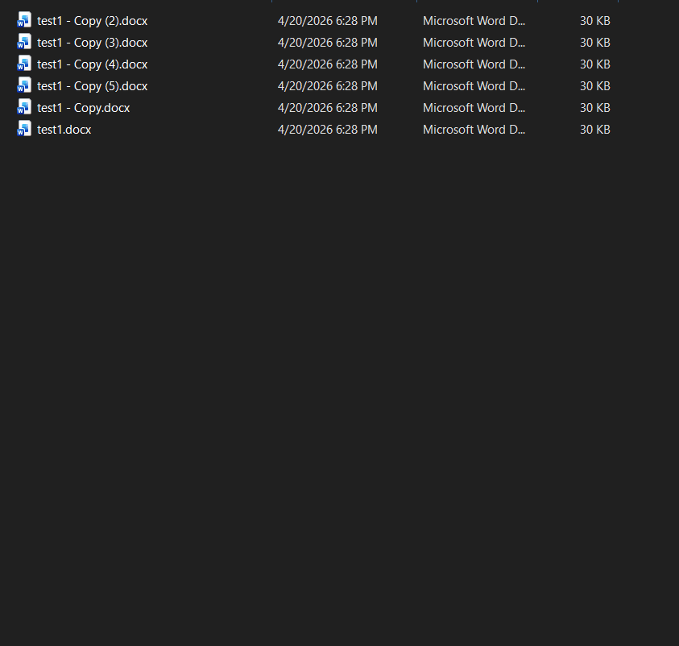

# DOCX to PDF — Right-Click Converter

Adds a "Convert to PDF" option to the Windows Explorer right-click menu for `.docx` files.

Uses Microsoft Word's built-in PDF export, so your formatting is preserved exactly.

## Demo



## Requirements

- Windows 10/11
- Microsoft Word (any recent version)
- PowerShell (ships with Windows)

## Install

1. Download/clone this repo
2. Open PowerShell in the repo folder
3. Run:

```powershell
powershell.exe -ExecutionPolicy Bypass -File .\install.ps1
```

4. Right-click any `.docx` file — you'll see **Convert to PDF**

## Usage

Right-click one or more `.docx` files and select **Convert to PDF**.
The PDF appears in the same folder with the same name.

## Uninstall

```powershell
powershell.exe -ExecutionPolicy Bypass -File .\uninstall.ps1
```

## How it works

- `install.ps1` copies the converter to `%LOCALAPPDATA%\DocxToPdf\` and adds a registry entry under `HKCU` (no admin needed)
- When you right-click and convert, `convert.ps1` launches Word invisibly via COM automation, opens the file, and saves it as PDF (format 17 = `wdFormatPDF`)
- `uninstall.ps1` removes the registry entry and the install folder
